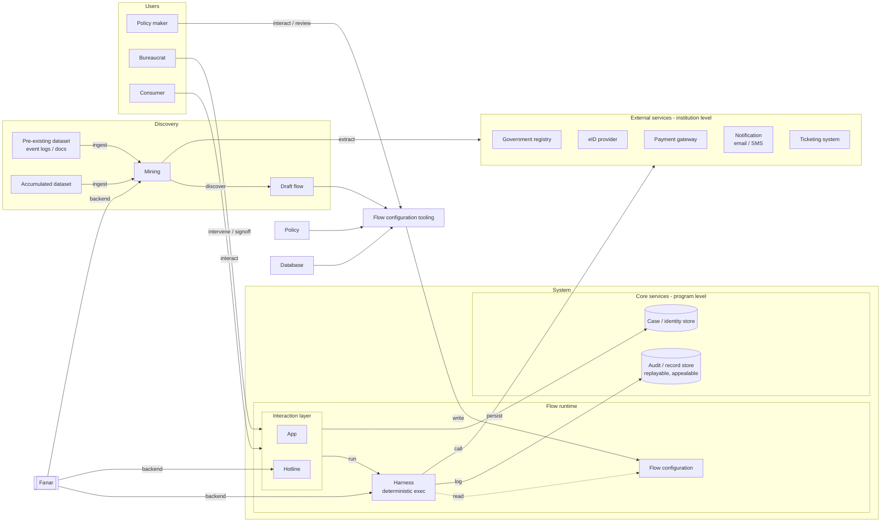
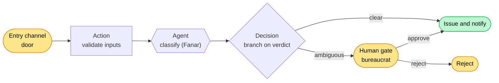

# Flowstate

> Codify bureaucratic procedures as deterministic workflows, with AI agents
> only where judgement is needed. Most procedures run automatically, while
> humans stay in the loop to handle genuine exceptions and resolve ambiguities.

Flowstate turns a government/institutional procedure into a **flow**, a
deterministic state machine, so routine applications flow through
automatically and only special cases pause for a bureaucrat. A policy maker
authors the flow visually; consumers submit applications across typed channels;
an AI agent (powered by **Fanar**) does the judgement-heavy steps and document
parsing (text, images, transcript summaries); and every
decision leaves an auditable, replayable trace.

- Theme: Smart Government & Citizen Services
- Model backend: Fanar (Arabic-capable LLM), usable online via Fanar API
  or self-hosted (any OpenAI-compatible server), swapped by config alone.
- Team: return 0; performed by Elyas Al-Amri and Osama Hasoneh

> Build, run, repository layout, and the demo walkthrough live in
> [demo.md](demo.md).

---

## 1. Problem Statement

Routine government applications are delayed, inconsistent, and expensive
because every case waits on a person, even though most cases are unambiguous
and only a few are true exceptions. Flowstate automates the routine
deterministically, escalates only the exceptions to a human, and keeps the
whole process accountable, replayable, and appealable. This matters
acutely in the Arabic and Gulf government context, where procedures, dialect,
and local rules demand a model like Fanar that can read and serve citizens in
their own language.

## 2. Solution Architecture

- **Discovery**: dataset (pre-existing + accumulated) -> mining -> draft flow.
- **Users**: policy maker (authors), bureaucrat (intervenes / signs off),
  consumer (is served).
- **Flow runtime**: flow configuration, harness (deterministic execution),
  interaction layer (app / hotline).
- **Core Services (program level)**: audit / record store, case / identity
  store.
- **External Services (institution level)**: government registry, eID,
  payment, notification, ticketing; plus policy and database as knowledge
  sources the mining flow extracts from.
- **Fanar**: model backend for the harness (and the hotline channel).

## 3. Agentic Workflow Design

A flow is a graph of typed nodes joined by guarded edges. A typed payload
submitted to an entry channel (the door) triggers it; deterministic nodes do
the routine work, the agent node defers judgement to Fanar, and only genuine
exceptions pause at a human gate.

Node colors carry the channel binding: yellow `ui` (a human-operated app),
green `service` (a core/external service), purple `flow` (a nested flow).

Maps to the agentic requirement targets:

- **Multi-step planning / decomposition**: the flow itself; nodes and edges.
- **Tool usage & orchestration**: per-tool allow/ask/deny gating.
- **Memory & state management**: core service, case / identity store.
- **Retrieval & knowledge integration**: extraction from policy + database
  into the configuration.
- **Autonomous execution**: the harness runs the flow deterministically.
- **Multi-agent collaboration**: subagents per task (own model / prompt /
  tools).

## 4. Use of Fanar and External Tools

### Main

- **Powering the harness**: Fanar is the model backend for the flow-runtime
  agent nodes (and the mining / draft-flow procedure).
- **Document parsing**: reading and extracting from uploaded evidence (text,
  images, transcript summaries) into structured verdicts the flow branches on.

### Extra

- **Hotline as a separate flow**: an Arabic speech / dialect interaction
  layer, run as its own flow and integrated into the main flow as a channel (independent blocks).

## 5. Evaluation Results

We evaluated the full Flowstate loop on two real public-sector datasets, run
**live against the real Fanar model** (`QCRI/Fanar-2-27B-Instruct`, self-hosted
on RunPod via vLLM), with Claude as a cross-check. The model swap was a one-line
config change (section 4), no code change. The harness, scoring scripts, and
model outputs are in `eval/` (run `python3 eval/parse_rtf.py && python3
eval/parse_ljp.py && python3 eval/score.py`); scoring is done by script against
a held-out key, never by the model.

**Datasets.**

- **Road-Traffic Fine Management** (BPI, an Italian municipality): 150,370 fine
  cases, 231 process variants. Ground-truth routine vs. non-routine is derived
  from process structure: a case is non-routine only if the offender appeals
  (prefecture or judge). This yields **97.0% routine, 3.0% exceptions**, the
  "few true exceptions" the system is built for.
- **Arabic-LJP** (Saudi commercial court): 538 judgements with Arabic case
  facts. The agent reads the facts (الوقائع) and predicts the ruling class:
  `accept`, `reject`, or `route` (declined jurisdiction). Facts never contain
  the ruling, so this is a genuine Arabic legal-judgement test.

**The three flows.** The loop is encoded as three real Flowstate flows under
[`examples/`](examples/) (authored to the `FlowDefinition` schema, with their
channels in `examples/flows/channels/`). All three pass the actual compiler
(`compileFlow` in `app/src/lib/flow/compile.ts`) with zero errors and emit valid
maestro YAML. Run the whole loop with `bash demo/run_demo.sh`, or rebuild the
flows alone with `python3 eval/build_flows.py`:

- **`flow-drafting`**: a meta-flow: event-log door → agent mines the model →
  agent drafts the flow → writes it to the flow library.
- **`fine-management-routine`**: the major flow: a deterministic spine
  (create → notify → pay, or unpaid → penalty → credit collection) that forks on
  `appeal_filed` into an agent assessment and a prefecture human gate, ending in
  paid / collected / appeal_upheld / appeal_rejected outcomes.
- **`flow-update`**: a meta-flow: exception-batch door → shell aggregation →
  agent proposes updates → `change_score >= 0.5` routes to a policy-maker human
  gate → writes the approved update back to the library.

**The loop, end to end.**

1. **Generate a flow from data.** From the variant statistics alone, the agent
   mined the routine flow: a deterministic spine (create → send → notify →
   pay, with credit collection as a routine unpaid branch) that forks at the
   notification step into an appeal branch: agent assessment, then a human gate
   (prefecture bureaucrat), then judge escalation. This is realised as the
   `fine-management-routine` flow above; see also `eval/data/mined_flow.md`.
2. **Classify routine vs. non-routine.** On a balanced blind sample of 60 fine
   cases, the agent scored **100% (60/60)**: it caught every appeal and, on the
   trap, never mistook automated credit collection for an exception.
3. **Process the routine / flag the exceptions.** The 97% routine majority runs
   the deterministic spine with no model discretion; only the 3% appeal cases
   reach the agent and the human gate.
4. **Arabic judgement.** On 50 blind Arabic cases (full facts), real Fanar
   reached **90% accuracy**, on par with Claude's **92%** on the same inputs,
   both with jurisdiction-routing at **100% recall**. See the lever sweep and
   the live-Fanar details below.
5. **Improve the flow from accumulated exceptions.** Aggregating all 4,567
   appealed cases, the agent proposed five concrete, data-backed flow updates
   (e.g. a guard `amount > 100 OR points > 0` targeting the ~834 appeals where
   contests concentrate; article-specific triage for codes with 10–29% appeal
   rates vs. a ~2.3% baseline). See `eval/data/improvements.md`.

| Track | Fanar | Claude | DeepSeek | GPT-5.5 |
| --- | --- | --- | --- | --- |
| Road-Traffic Fines: routine vs. non-routine (60 blind) | 100% | 100% | 100% | 100% |
| Arabic-LJP: accept / reject / route (50 blind, full facts) | ~98%* | 100% | 100% | 100% |

Flow artifacts: 3 flows authored in `examples/`, all compile clean to valid
maestro YAML. Improvement loop: 4,567 exceptions aggregated into 5 data-backed
flow updates.

All four models score 100% on conformance. On Arabic-LJP the three frontier
models score **100%** with zero errors, but only after an audit. Initially all three "failed" the same 4 cases, which on inspection
turned out to be **ground-truth labeling errors**: the keyword labeler tagged
rulings as `reject` when they actually granted the claim (`بإلزام ... بأن يدفع`,
ordering payment) and only rejected the *remainder* of requests
(`رفض ما عدا ذلك`). The models were right; the labels were wrong. Fixing the
labeler (`accept` wins over a partial-rejection clause, see `eval/parse_ljp.py`)
takes every frontier model to 100%.

*Fanar's full-facts per-case predictions were not persisted (only error-type
counts: 4 `reject -> accept` + 1 unparsed verdict), so its corrected score is
estimated at ~98%: the 4 `reject -> accept` align with the corrected labels,
leaving the single format artifact. A clean recompute needs re-running the
endpoint.

The lesson: at this sample size, frontier models solve Arabic-LJP once the
labels are clean; the binding constraint was eval-label quality, not model
capability. The human gate earns its keep on genuinely ambiguous cases and on
the conformance design, not on these four.

### Live Fanar validation

Both tracks were re-run on real Fanar (full results in
[`eval/data/fanar_findings.md`](eval/data/fanar_findings.md)):

- **Conformance: 100%** (60/60), matching Claude exactly, including the
  credit-collection trap a keyword matcher would fail.
- **Arabic-LJP: 90%** on full facts, on par with **Claude's 92%** on the same
  full facts (a fair head-to-head; Claude's earlier 86% was on clipped facts).
  The decisive lever was feeding the **full untruncated case facts**: an earlier
  1,800-char clip cut the part of the case that determines a rejection, capping
  Fanar at 74%. Few-shot (66%) and self-consistency (74%) did not help; not
  handicapping the input did. Both models share the same residual error mode
  (`reject → accept` on procedural rejections).
- **Fanar-2-27B is a reasoning model** (`<think>`). Forcing terse output
  truncates the verdict, and `/no_think` / `enable_thinking=false` / system
  prompts do **not** suppress it. The harness must budget tokens and parse after
  `</think>`.
- **Self-reported confidence is uninformative** (Fanar returns `high` on every
  case, including wrong ones), so a human gate cannot rely on it; it needs
  logprobs or ensemble disagreement.
- **Arabic generation and the meta-flows work well**: clean formal Arabic
  decision letters, accurate JSON extraction, and flow mining / improvement
  proposals comparable to Claude.

**Where it did well.** Perfect conformance (incl. the trap); 90% Arabic
judgement with strong jurisdiction routing; specific, data-grounded mining and
improvement proposals.

**Limitations.** The remaining Arabic-LJP errors are `reject → accept`: the
model over-grants borderline claims the court actually rejected on procedural
grounds (standing, mediation, jurisdiction): the judgement-heavy tail the human
gate exists for. Legal-track labels are derived by ruling-text keywords, so a
small label-noise margin applies; samples (60 / 50) are small, so treat the
percentages as feasibility signals with wide intervals.

## 6. Recommendations for Future Fanar Improvements

Distilled from section 5, focused on what would make Fanar a stronger backend
for deterministic, auditable government flows:

- **Calibrated abstention.** The agent's costliest errors were confident
  `reject → accept` flips on procedural dismissals. A reliable, calibrated
  confidence (or an explicit "unsure") would let the flow escalate exactly the
  borderline cases to the human gate instead of deciding them, which is the
  whole point of the design.
- **Structured verdict output.** Flowstate parses a `VERDICT: <word>` line.
  First-class support for constrained/structured output (a fixed label set,
  optionally with a confidence field) would remove the parsing seam and make the
  one non-deterministic node more predictable.
- **Saudi/Gulf legal and administrative grounding.** The reject→accept errors
  track Saudi-specific procedure (mediation prerequisites, standing/صفة,
  jurisdiction). Stronger grounding in local procedural rules would lift exactly
  the cases that currently need a human.
- **Long-document robustness.** Facts were clipped to ~1,800 characters to fit;
  real dossiers (uploaded proofs, transcripts) are longer. Stable judgement over
  long Arabic documents would widen the set of procedures Flowstate can automate.
- **Determinism aids.** `temperature: 0` is necessary but not sufficient.
  Run-to-run stability guarantees on identical prompts would strengthen the
  replayable/appealable property the harness promises.
</content>
