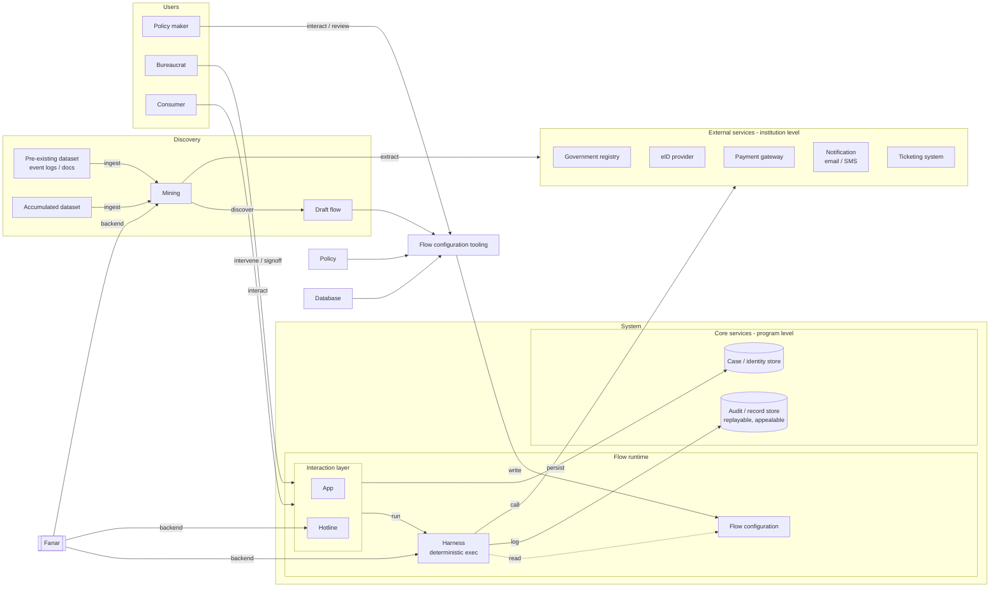

# Flowstate

> Codify bureaucratic procedures as deterministic workflows, with AI agents
> only where judgement is needed. Most procedures run automatically, while
> humans stay in the loop to handle genuine exceptions and resolve ambiguities.

Flowstate turns a government/institutional procedure into a **flow**, a
deterministic state machine, so routine applications flow through
automatically and only special cases pause for a bureaucrat. A policy maker
authors the flow visually; consumers submit applications across typed channels;
an AI agent (powered by **Fanar**) does the judgement-heavy steps and document
parsing (text, images, transcript summaries); and every
decision leaves an auditable, replayable trace.

- Theme: Smart Government & Citizen Services
- Model backend: Fanar (Arabic-capable LLM), usable online via Fanar API
  or self-hosted (any OpenAI-compatible server), swapped by config alone.
- Team: return 0; performed by Elyas Al-Amri and Osama Hasoneh

> Build, run, repository layout, and the demo walkthrough live in
> [demo.md](demo.md).

---

## 1. Problem Statement

Routine government applications are delayed, inconsistent, and expensive
because every case waits on a person, even though most cases are unambiguous
and only a few are true exceptions. Flowstate automates the routine
deterministically, escalates only the exceptions to a human, and keeps the
whole process accountable, replayable, and appealable. This matters
acutely in the Arabic and Gulf government context, where procedures, dialect,
and local rules demand a model like Fanar that can read and serve citizens in
their own language.

## 2. Solution Architecture

- **Discovery**: dataset (pre-existing + accumulated) -> mining -> draft flow.
- **Users**: policy maker (authors), bureaucrat (intervenes / signs off),
  consumer (is served).
- **Flow runtime**: flow configuration, harness (deterministic execution),
  interaction layer (app / hotline).
- **Core Services (program level)**: audit / record store, case / identity
  store.
- **External Services (institution level)**: government registry, eID,
  payment, notification, ticketing; plus policy and database as knowledge
  sources the mining flow extracts from.
- **Fanar**: model backend for the harness (and the hotline channel).

## 3. Agentic Workflow Design

A flow is a graph of typed nodes joined by guarded edges. A typed payload
submitted to an entry channel (the door) triggers it; deterministic nodes do
the routine work, the agent node defers judgement to Fanar, and only genuine
exceptions pause at a human gate.

Node colors carry the channel binding: yellow `ui` (a human-operated app),
green `service` (a core/external service), purple `flow` (a nested flow).

Maps to the agentic requirement targets:

- **Multi-step planning / decomposition**: the flow itself; nodes and edges.
- **Tool usage & orchestration**: per-tool allow/ask/deny gating.
- **Memory & state management**: core service, case / identity store.
- **Retrieval & knowledge integration**: extraction from policy + database
  into the configuration.
- **Autonomous execution**: the harness runs the flow deterministically.
- **Multi-agent collaboration**: subagents per task (own model / prompt /
  tools).

## 4. Use of Fanar and External Tools

### Main

- **Powering the harness**: Fanar is the model backend for the flow-runtime
  agent nodes (and the mining / draft-flow procedure).
- **Document parsing**: reading and extracting from uploaded evidence (text,
  images, transcript summaries) into structured verdicts the flow branches on.

### Extra

- **Hotline as a separate workflow**: an Arabic speech / dialect interaction
  layer, run as its own flow rather than part of the core procedure.

## 5. Evaluation Results

- Fanar vs. alternative model on the key Arabic tasks.
- Where Fanar handled the task well.
- Where we needed external tools or a different model.
- Limitations encountered during development.

## 6. Recommendations for Future Fanar Improvements

- Actionable recommendations distilled from section 5.
</content>
