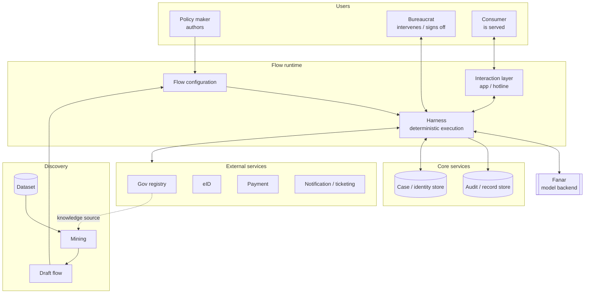
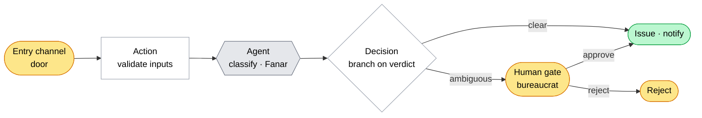

# Flowstate

> Codify bureaucratic procedures as deterministic workflows, with AI agents
> only where judgement is needed. Most procedures run automatically, while
> humans stay in the loop to handle genuine exceptions and resolve ambiguities.

Flowstate turns a government/institutional procedure into a **flow**, a
deterministic state machine, so routine applications flow through
automatically and only special cases pause for a bureaucrat. A policy maker
authors the flow visually; consumers submit applications across typed channels;
an AI agent (powered by **Fanar**) does the judgement-heavy steps and document
parsing (text, images, transcript summaries); and every
decision leaves an auditable, replayable trace.

- **Theme:** Smart Government & Citizen Services
- **Model backend:** Fanar (Arabic-capable LLM), usable **online** (Fanar API)
  or **self-hosted** (any OpenAI-compatible server), swapped by config alone.
- **Team:** Osama, Elyas

> Build, run, repository layout, and the demo walkthrough live in
> [demo.md](demo.md).

---

## 1. Problem Statement

- The cost of humans-in-the-loop: routine applications are delayed,
  inconsistent, and expensive when every case waits on a person.
- Observation: most cases are automatable; few are true exceptions.
- Value proposition: automate the routine deterministically, escalate only
  the exceptions, and keep the whole thing accountable (replayable, appealable).
- Why Arabic / Gulf government context matters here (Fanar, dialect, local
  procedures).

## 2. Solution Architecture

- **Discovery**: dataset (pre-existing + accumulated) -> mining -> draft flow.
- **Users**: policy maker (authors), bureaucrat (intervenes / signs off),
  consumer (is served).
- **Flow runtime**: flow configuration, harness (deterministic execution),
  interaction layer (app / hotline).
- **Core Services (program level)**: audit / record store, case / identity
  store.
- **External Services (institution level)**: government registry, eID,
  payment, notification, ticketing; plus policy and database as knowledge
  sources the mining flow extracts from.
- **Fanar**: model backend for the harness (and the hotline channel).

## 3. Agentic Workflow Design

A flow is a graph of typed nodes joined by guarded edges. A typed payload
submitted to an entry channel (the door) triggers it; deterministic nodes do
the routine work, the agent node defers judgement to Fanar, and only genuine
exceptions pause at a human gate.

Node colors carry the channel binding: yellow `ui` (a human-operated app),
green `service` (a core/external service), purple `flow` (a nested flow).

Maps to the agentic requirement targets:

- **Multi-step planning / decomposition**: the flow itself; nodes and edges.
- **Tool usage & orchestration**: per-tool allow/ask/deny gating.
- **Memory & state management**: core service, case / identity store.
- **Retrieval & knowledge integration**: extraction from policy + database
  into the configuration.
- **Autonomous execution**: the harness runs the flow deterministically.
- **Multi-agent collaboration**: subagents per task (own model / prompt /
  tools).

## 4. Use of Fanar and External Tools

- **Fanar as harness backend**: runs the flow-runtime agents and the
  mining/draft-flow procedure.
- **Fanar for the hotline**: Arabic speech / dialect interaction layer.
- **Arabic capability demonstration**: a capability showcase, not a training
  method.
- **External tools**: aiXamine (security safeguards), eID / registry /
  payment integrations.

## 5. Evaluation Results

- Fanar vs. alternative model on the key Arabic tasks.
- Where Fanar handled the task well.
- Where we needed external tools or a different model.
- Limitations encountered during development.

## 6. Recommendations for Future Fanar Improvements

- Actionable recommendations distilled from section 5.
</content>
