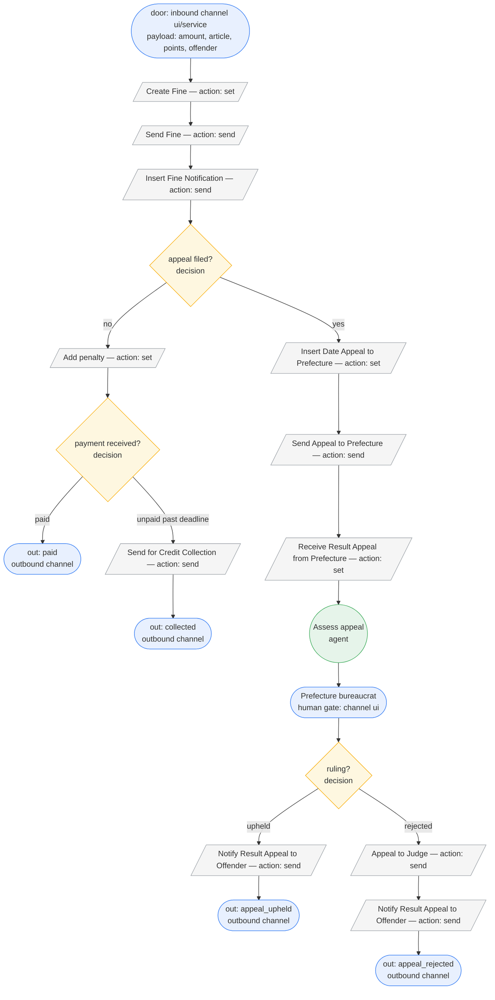

# Mined flow — Municipal Road-Traffic Fine Management

Source: `stats.json` — 150,370 cases, 97% routine, 3% non-routine, 231 variants.

## Routine path

The deterministic spine, recovered from the four dominant variants (37.6% + 30.8% + 13.6% + 6.3% ≈ 88% of traffic):

1. A fine is **created** from the inbound payload (amount, article, points, offender) and **sent**.
2. The municipality **inserts the notification** of delivery, after which an **`Add penalty`** is applied if the statutory grace window lapses.
3. The case resolves on a **payment decision**:
   - **Paid** → the fine is closed as `paid`. (Early payment can short-circuit straight after Create/Send — variants 2, 3, 7 — so the payment decision is evaluated before penalty too.)
   - **Unpaid** past the deadline → routed to **`Send for Credit Collection`** and closed as `collected` (variant 1, 37.6%).

The exception branch **forks at the notification step**: if the offender files an appeal, the case leaves the payment/collection spine at `Insert Date Appeal to Prefecture` (variants 8 & 11) and enters judgement. The appeal is assessed by the **agent** node, then handed to a **human gate** (the prefecture bureaucrat, a ui channel) for the binding decision; rejected appeals may escalate to `Appeal to Judge`.

## Flowchart

## Nodes

- **door** — `channel` (binding: ui/service, inbound). Receives typed payload `{amount, article, points, offender}`. Entry.
- **Create Fine** — `action` (set). Materialise the fine record from payload.
- **Send Fine** — `action` (send). Dispatch fine to offender.
- **Insert Fine Notification** — `action` (send). Record proof of delivery.
- **appeal filed?** — `decision`. Guard: `offender.appeal_filed == true` → appeal branch; else routine.
- **Add penalty** — `action` (set). Guard: `now > notification.date + grace_days` (statutory surcharge).
- **payment received?** — `decision`. Guards: `payment.amount >= fine.total` → paid; `now > deadline && payment is null` → unpaid/collection.
- **Send for Credit Collection** — `action` (send). Routine branch for unpaid fines.
- **Insert Date Appeal to Prefecture** — `action` (set). Stamp appeal intake date.
- **Send Appeal to Prefecture** — `action` (send). Forward dossier to prefecture.
- **Receive Result Appeal from Prefecture** — `action` (set). Ingest prefecture response.
- **Assess appeal** — `agent` (AI judgement). Weighs article, points, evidence; drafts a recommended ruling for the gate.
- **Prefecture bureaucrat** — `channel` (binding: ui) — **human gate**. Binding sign-off on the appeal ruling.
- **ruling?** — `decision`. Guard: `ruling == "upheld"` → notify + close; `ruling == "rejected"` → judge escalation.
- **Notify Result Appeal to Offender** — `action` (send). Communicate the outcome.
- **Appeal to Judge** — `action` (send). Escalation when appeal rejected and offender contests.
- **out: paid / collected / appeal_upheld / appeal_rejected** — `channel` (outbound). Terminal outcomes.

